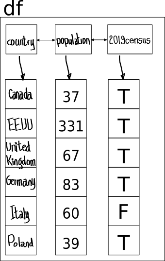

```{r setup, include=FALSE}
library(learnr)
knitr::opts_chunk$set(echo = FALSE)
```

<!-- ======================== -->

## 🟢 What you will learn

<!-- ======================== -->


By the end of this tutorial, you will know how to build a data frame, how to subset it, create new columns and rows applying operators on existing ones, and how to handle missing values (NAs). 
Transforming a data frame is the basis for powerful data analysis that will be illustrated with a brief example. 

The data frame is a native data structure to R, so the syntax is very similar if not identical to the one used for vectors, matrices, and lists, making R code consistent and expressive.
Missing value types are also native to R so their occurrence can be an accurate representation of their origin and potential meaning.


<!-- ======================== -->

## 🟢 About this tutorial

<!-- ======================== -->

This introductory tutorial about the base R syntax can be used as a presentation by an instructor or as a self-study guide. 
It contains explanations, fully functional code boxes, and quizzes that make it interactive. 
When time allows during a guided session, the student can edit and execute code to test how the syntax works. 
This provides invaluable hands-on feedback. 
The instructor may also ask short questions regarding the material.
Should you fall behind or need more time for the exercises and quizzes, please complete them after the live session.
This is very important in order to cement the concepts and challenge your understanding.

The emphasis of this tutorial is on why R works the way it does and less on being a reference manual or a source of recipes.
In doing so we hope to get you excited about this useful and expressive language.
R was designed from the ground up to be vectorized and object oriented.
Its aim is to be useful for both experts and beginners with the need to do computational statistics, data analysis and data visualization tasks.

Several sources describe the three types of R Syntax [@RSyntax-Cheatsheet], [@RSyntaxComparison-Cheatsheet]: the dollar sign, the formula, and the Tidyverse. These syntaxes are interchangeable, the important thing is to be consistent when using them. The formula syntax tends to be more compact but less readable while the Tidyverse syntax is more readable but also more verbose. We will focus on the dollar syntax.
<!-- Later we introduce the formula syntax and finally the tidyverse syntax. -->

This tutorial was built entirely in R using a package called `learnr`.
It was compiled to an html document using Rmarkdown syntax and the `Knitr` package.
If you receive the source code and have RStudio, you can render it as a fully interactive web page.
Using an Rstudio (Posit) solution it can also be deployed on a ShinyR server.
You can also do these things and much more if you move forward in your R journey.

Finally, if you are following this material on a browser, every time you reopen this page the tutorial will be in the previous state you left it the last time you worked on it.
If you want to reset your answers and the code you've run on the exercises, erasing all of your previous history, press the `Start Over` option at the bottom left on the main panel.

Let's get started.


## ✅️ Data frames

If you have followed the Part 4 Lists, of this tutorial, then this module should be relatively easy. Like a list, data frames store information of heterogeneous type, however there are some rules:

  - Two dimensional only, like a table.
  - Any number of rows or columns
  - Each column has to be a vector of the same length (each can store different data types)  


Follow these rules and data frames are an almost ideal data structure for data analysis, as convenient but safer than spreadsheets, whether in memory or saved as a file to a disk, locally or in the cloud. 

Data frames are similar to tables of a sophisticated relational data base, where you can store procedures (like R expressions) and even other tables in the cells.

## ✅️ Why is a data frame different?

Under the hood a data frame is implemented as a list of vectors of the same length. The algorithms to search and select items in data frames can be optimized because its two more prominent features:

 * table-like geometry
 * vector columns of equal length. 
 
The elements of a vector are stored in contiguous memory of constant size and this gives the data frame some advantages. The good news is data frames have been natively implemented to use the `$` and `[` operator syntax that we already know. This knowledge can be safely reused for data frames.


## ✅️ Constructing a data frame

```{r, data-frame, echo=FALSE, results='asis', dpi=70}

```

Let's create this data frame using code using the constructor function `data.frame`.

```{r, data-frame-constructor, exercise=TRUE, exercise.lines=6}
# for better documentation name the vectors
country <- c("Canada", "EEUU", "United Kingdom", "Germany", "Italy", "Poland")
population <- c(37, 331, 67, 83, 60, 39)
census2019 <- c(T,T,T,T,F,T)
# the dot in names means nothing special in R, see note below for explanation
(df <- data.frame(country, population, census2019))
```

*Note:* In R the dot for names has no special meaning, it is like `_`. The dot syntax for formulas and in generic object dispatch has special meaning, but those are topics for more advanced material.

If any of the vectors has a different length there will be error messages, R will not be happy about it. Try it for yourself in the previous code box.

Try the `str()` function on the data frame we just created. R has a special vocabulary for the rows and columns of a data frame. Each of the <span style="color:blue">vectors</span> in the list are mapped to a <span style="color:blue">variable</span> while each <span style="color:red">row</span> represents an <span style="color:red">observation</span>.


## ✅️ Subsetting a data frame

Similarly to subsetting vectors, we can slice and extract sections of the data frame as we please following the row, column convention of matrices and the `[]` syntax or the `$` syntax of vectors and lists, respectively.

```{r sliceAndDiceDfSetup}
# for better documentation name the vectors
country <- c("Canada", "EEUU", "United Kingdom", "Germany", "Italy", "Poland")
population <- c(37, 331, 67, 83, 60, 39)
census2019 <- c(T,T,T,T,F,T)
df <- data.frame(country, population, census2019)
```

```{r slice-n-dice-df, exercise=TRUE, exercise.setup="sliceAndDiceDfSetup", exercise.lines=9}
# using the $ operator like in a named list
df$country
df$"country"
# using the [] operator similar to a matrix and a vector
df[,1]
df[,"country"]
# using the fact that a data frame is a list under the hood
df[[1]]
df[["country"]]
```

Let's  extract all the information for Canada. 

```{r subsetDfByRowSetup}
# for better documentation name the vectors
country <- c("Canada", "EEUU", "United Kingdom", "Germany", "Italy", "Poland")
population <- c(37, 331, 67, 83, 60, 39)
census2019 <- c(T,T,T,T,F,T)
df <- data.frame(country, population, census2019)
```

```{r subset-df-by-row, exercise=TRUE, exercise.setup="subsetDfByRowSetup", exercise.lines=2}
df[df$country == "Canada",]
```

We can extract the countries with population greater than 80 million.

```{r subset-df-by-multiple-rows, exercise=TRUE, exercise.setup="subsetDfByRowSetup", exercise.lines=6}
# extract only the names of the counties  in the rows filtered
df[df$population > 80, 'country']
# display all the columns for the rows filtered
df[df$population > 80,]
```

This way of sub-setting a data frame uses a **_logical mask_**. The mask is nothing but a Boolean vector generated using a logical operator. The Boolean vector is then used to sub-set another vector using the `[]` operator selecting the elements of the vector at the positions where the mask is `TRUE`. Since the columns of a data frame are vectors, this is a natural way of sub-setting. 

This image helps explain it.

```{r data-frame-row-filter, echo=FALSE, results='asis', fig.height=1}
knitr::include_graphics("images/dataframe-row-filter.png", dpi = 126)
```

And here is a step by step description:

  1. Build the mask using a logical operator expressing a condition over one of the columns of the data frame.

```{r explain-logical-mask-1, exercise=TRUE, exercise.lines=1, exercise.setup="subsetDfByRowSetup"}
(row_filter <- df$population > 80)
```
  2. Subset the data frame by rows using this logical mask. A `TRUE` at a given position on the mask  will let the value at that position on each row of the data frame pass _as is_. Conversely, a `FALSE` will eliminate it so it does not appear on the result.

```{r explainLogicalMaskSetup}
country <- c("Canada", "EEUU", "United Kingdom", "Germany", "Italy", "Poland")
population <- c(37, 331, 67, 83, 60, 39)
census2019 <- c(T,T,T,T,F,T)
df <- data.frame(country, population, census2019)
row_filter <- df$population > 80
```


```{r explain-logical-mask-2, exercise=TRUE, exercise.lines=2, exercise.setup="explainLogicalMaskSetup"}
# apply the same filter to every column of the data frame by
(result <- df[row_filter,])
```
  3. Show the column for country from the 2019 census:

```{r explainLogicalMask3Setup}
country <- c("Canada", "EEUU", "United Kingdom", "Germany", "Italy", "Poland")
population <- c(37, 331, 67, 83, 60, 39)
census2019 <- c(T,T,T,T,F,T)
df <- data.frame(country, population, census2019)
filter <- df$population > 80
result <- df[filter,]
```


```{r explain-logical-mask-3, exercise=TRUE, exercise.lines=2, exercise.setup="explainLogicalMask3Setup"}
# apply the filter to all the vectors of the data frame
result[c("country", "population")]
```


## ✅️ Reusing your R Syntax

At this point in your R Syntax journey you may start to appreciate that some patterns. Here is an image taken from @BaseR-Cheatsheet that might show some of these patterns.

```{r, data-frame-sheat-sheet-example, echo=FALSE, results='asis'}
  knitr::include_graphics("images/Dataframe_shortcuts_from_BaseR_Cheat_Sheet.png", dpi = 96)
```

As a very special case of a list, you would expect to be able to reuse some of your list manipulation knowledge, right? In a similar way, with the _table-like_ shape you would expect to be able to re-use some of your knowledge of `cbind` and `rbind`, correct?

## ✅️ The subsetting function

The built-in function `subset` takes a data frame and returns a new object with the requested data frame. This function receives a logical vector as named argument `subset`, this vector marks with `TRUE` the elements that should be included and `FALSE` otherwise. Another optional parameter called `select` is a vector with the column positions or names to include by default, unless a third parameter called `drop` is set to TRUE, in which case the selected values are dropped from the resulting subset.

As an example let's take the time series for quarterly earnings per share for Johnson and Johnson from 1960 to 1980, part of the `datasets` package included in modern default R installations. We are  asked to extract the years when the last quarter earnings were greater than 60% of the annual earning per share and show the last quarter and the total earnings.

Normally we would first explore the data set.

```{r, JAndJDataSetup}
J_and_J <- data.frame( matrix(JohnsonJohnson, 
                              ncol=4, 
                              dimnames = list( 1960:1980, c("Qtr1", "Qtr2", "Qtr3", "Qtr4"))))
```

```{r, explore_J_and_J_data, exercise=TRUE}
class(JohnsonJohnson)
# "ts" is a time series object, do ?ts at the R command prompt
# turn it into a matrix with 4 columns, then turn it into a data frame
matrix(JohnsonJohnson, ncol=4)
```

Now the matrix can be turned into a data frame. We could have also kept the matrix, can you answer why and what differences if any we would have encountered? 

When we construct the new data frame we can assign names to each column and row labels as each year of company financial results. Please note how we are using list and vector constructors to supply 
the names  for the two dimensions of the data frame. remember the `:` operator we learned as a shortcut for the `seq()` function in the module on vectors when discussing creating vectors with patterns?

```{R, constructAProperDataFrame, exercise=TRUE}
(J_and_J <- data.frame( matrix(JohnsonJohnson, 
                              ncol=4, 
                              dimnames = list( 1960:1980, c("Qtr1", "Qtr2", "Qtr3", "Qtr4")))))
```

We want a new column with the total sales per year. This can be accomplish creating a 
vector of totals per row and then appending it to the data frame as a new column 
with the name `Annual`. Does the new column fulfill the requirements of a data frame? 
Remember: the columns of a data frame are vectors that may be of different types each but all of them have to be of the same length.


```{r, addColumnToDataFrame, exercise=TRUE, exercise.setup="JAndJDataSetup"}
# add a new column with the annual earnings
(J_and_J <- cbind(J_and_J, Annual=rowSums(J_and_J)))
```

```{r, JAndJDataSetupWithTotals}
J_and_J <- data.frame( matrix(JohnsonJohnson, 
                              ncol=4, 
                              dimnames = list( 1960:1980, c("Qtr1", "Qtr2", "Qtr3", "Qtr4"))))
J_and_J <- cbind(J_and_J, Annual=rowSums(J_and_J))
Qtr4_percent <- J_and_J$Qtr4 / J_and_J$Annual * 100
mask.Q4.GT.60.pct.Total <- ( Qtr4_percent > 60 )
```

Now you are ready to create a mask to extract the desired values. You will use R's vectorized
nature and dollar syntax to select the desired columns from the data frame. This 
code would have looked slightly different had we decided to work with the matrix instead
of a data frame, however the results would have been equivalent.

```{r, buildAMaskForJAndJDataFrame, exercise=TRUE, exercise.setup="JAndJDataSetupWithTotals"}
# create a vector with the 4th quarter earnings as a percentage of the annual earnings 
(Qtr4_percent <- 
    J_and_J$Qtr4 / J_and_J$Annual * 100)
# create the logical mask
(mask.Q4.GT.60.pct.Total <- (Qtr4_percent > 60))
```

At this point all the components are available to apply the builtin function `subset` to
answer the main question.

```{r, finalSubsetJAndJDataFrame, exercise=TRUE, exercise.setup="JAndJDataSetupWithTotals"}
subset(J_and_J, subset = mask.Q4.GT.60.pct.Total, select = c("Qtr4","Annual")) 
#subset(J_and_J, subset = mask.Q4.GT.60.pct.Total, select = c(4,5)) 
```

That was a company on a roll in the 70's!

Please note that you could replace the convenient function `subset` for plain vanilla base R Syntax, the same one you have been studying in this tutorial. Below the code. It is nothing more than a mask for the rows that we are interested in and a vector of column names to "select" in the output. This is an example of subsetting a data frame at its best.

```{r, base-R-Syntax-to-replace-subset-function-in-scripts, exercise=TRUE, exercise.setup="JAndJDataSetupWithTotals"}
J_and_J[mask.Q4.GT.60.pct.Total, c("Qtr4", "Annual")]
```


**Note:** the `subset` function exposes a behaviour called "non-standard evaluation" in R. That means that when setting the arguments on a call to the function, the argument can be interpreted as a character string first even if it exists as a variable name. They are very convenient in interactive work at the command line (also called the REPL, [Read-evaluate-print-loop](https://en.wikipedia.org/wiki/Read%E2%80%93eval%E2%80%93print_loop), as it is known). The best practice is not to use `subset` in programs. Use either base R subsetting syntax or the **tidy** packages derived from the work of Hadley Wickham [@tidy-data].


## ✅️ Subsetting and transforming

A very common operation on data frames is to aggregate the values in one or more columns of observations that belong to the same category. 
The nature of the aggregation can be an operation like counting, adding, or by extension, applying any function that takes a value and returns it in a transformed state.

In the following example we will walk through an application of this pattern to answer the question of how many of the treatments in a controlled experiment resulted in a minimum passing threshold value and what was their mean result. 

First create a data frame with some results from a fictional clinical trial for two treatments and a control. If the result blood marker is above 42.5 µg/L, the treatment is considered successful.
First create the synthetic experimental result data.

```{r aggregating-examples, message=TRUE, warning=FALSE, exercise=TRUE}
set.seed(5529L)
(treatment_names <- LETTERS[sample(x = 1:26, size = 3, replace = FALSE)])
library(sn) # skewed normal distribution
n1=330; n2=281; n3=410 # the number of test cases for each of the three treatments
# generate synthetic data for each treatment
params.1 <- cp2dp(c(50, 10, -0.5), "SN")
treatment.1 <- abs(rsn(n1, dp = params.1))
params.2 <- abs(cp2dp(c(60, 30, -0.25), "SN"))
treatment.2 <- rsn(n2, dp = params.2)
# This would be the control
treatment.3 <- round(runif(n3)*50, digits = 2)
```

```{r, aggregationExamplesSetup}
set.seed(5529L)
treatment_names <- LETTERS[sample(x = 1:26, size = 3, replace = FALSE)] # vector to be recycled by data frame
library(sn)
n1=330; n2=281; n3=410 # the number of test cases for each of the three treatments
# generate synthetic data for each treatment
params.1 <- cp2dp(c(50, 10, -0.5), "SN")
treatment.1 <- abs(rsn(n1, dp = params.1))
params.2 <- cp2dp(c(60, 30, -0.25), "SN")
treatment.2 <- abs(rsn(n2, dp = params.2))
treatment.3 <- round(runif(n3)*50, digits = 2)
results <- c(treatment.1,treatment.2,treatment.3)
# the treatment code for the results vector are their names attribute
names(results) <- c(rep(treatment_names[1],n1), rep(treatment_names[2],n2), rep(treatment_names[3],n3))
# Criteria for success
passes_GT_42.5 <- results > 42.5 
# we are ready to build the data frame
experiments <- data.frame(treatment = names(results), 
                 outcome=results,
                 passes = passes_GT_42.5)
#randomize the representation of the experiments
(experiments <- experiments[sample(nrow(experiments), replace = FALSE), ])
(outcome_mean_by_treatment <- aggregate(x = experiments$outcome,
                                        by = list(experiments$treatment),
                                        FUN = "mean"))
# the calculate the number of results that pass the clinical criteria
(num_successful_cases_by_treatment <- aggregate(x = experiments$passes,
                                                by = list(experiments$treatment),
                                                FUN = "sum"))
(treatment_counts <- aggregate(x = experiments$treatment,
                               by = list(experiments$treatment),
                               FUN = "length"))
```

Now we can assemble the data frame with the results, the treatment code, and the criteria for success.

```{r, aggregate-example-the-data-frame, exercise=TRUE, exercise.setup="aggregationExamplesSetup"}
results <- c(treatment.1,treatment.2,treatment.3)
# the treatment code for the results vector are their names attribute
names(results) <- c(rep(treatment_names[1],n1), rep(treatment_names[2],n2), rep(treatment_names[3],n3))
# Criteria for success
passes_GT_42.5 <- results > 42.5 
# we are ready to build the data frame
experiments <- data.frame(treatment = names(results), 
                 outcome=results,
                 passes = passes_GT_42.5)
#randomize the representation of the experiments
(experiments <- experiments[sample(nrow(experiments), replace = FALSE), ])
```

Then we will answer the two questions separately.
First by calculating the mean of the results per treatment in a new data frame called `outcome_mean_by_treatment`.
Then by counting the number of cases that pass our criteria (greater than `42.5`µg/L by the value of the column `passes`) in the data frame `num_successful_cases_by_treatment`.


```{r, aggregation-example-adding, exercise=TRUE, exercise.setup="aggregationExamplesSetup"}
# first calculate the mean outcome for each treatment
(outcome_mean_by_treatment <- aggregate(x = experiments$outcome,
                                   by = list(experiments$treatment),
                                   FUN = "mean"))
# then calculate the number of results that pass the criteria for success
(num_successful_cases_by_treatment <- aggregate(x = experiments$passes,
                                                by = list(experiments$treatment),
                                                FUN = "sum"))
(treatment_counts <- aggregate(x = experiments$treatment,
                               by = list(experiments$treatment),
                               FUN = "length"))
```
The function `aggregate` gives default names to the columns of the resulting data frame: `Group.1` and `x`.
There are at least two ways of generating a single data frame from these two partial results.
First we will use `cbind` to append the column of results from the second data frame, called `x`, to the first data frame.


```{r, final-cbind, exercise=TRUE, exercise.setup="aggregationExamplesSetup"}
# now put them together in a single data frame
aggregated_df <- cbind(outcome_mean_by_treatment,
                       num_successful_cases_by_treatment$x,
                       treatment_counts$x) 
names(aggregated_df) <- c("treatment", "mean","# of pass", "# total")
aggregated_df
```

A second, arguably more elegant solution is to apply the R built-in function `merge` to join the two partial results for mean outcome and number of outcomes greater than 42.5 µg/L.
An important requisite to merge two data frames is that they share a column with the same identifier. 
In our case that column is `Group.1`, created by the function `aggregate` in the previous step.

```{r, merge, exercise=TRUE, exercise.setup="aggregationExamplesSetup"}
results_df <- merge( x = outcome_mean_by_treatment, 
                     y = num_successful_cases_by_treatment,
                     by = "Group.1", 
                     all = TRUE)
results_df <- merge( x =results_df,
                     y= treatment_counts,
                     by = "Group.1",
                     all = TRUE)
names(results_df) = c("treatment", "mean","# of pass", "# total")
results_df
```

When this function is called with the argument `all = TRUE`, this is equivalent to a SQL query for a full `JOIN` function between two tables. 

Technicalities aside, can you spot the control group from the last table and the knowledge of the way the synthetic data was created?
You will have to investigate what the `runif` function does. 
Apparently the two treatments have means well above the control group. 
More analysis is needed to answer this with more statistical certainty. 


## ✅️ Factors or strings

It used to be that R converted strings to factors unless told otherwise, so the countries defined in the previous section would have been defined as a vector of factors with 6 levels instead of a vector of six character strings representing country names. 

When you construct a data frame from vectors the type of each vector will be interpreted by the data frame constructor. R will coerce the elements of the vector to the most general data type to be able to work with them. An ordering of types from more  general to more specific is `character` > `complex` > `double` > `integer` > `logical`. 

You can give R hints, though, for instance you can tell it to interpret the strings in vectors as factors, base R recently stopped doing so by default.

```{r example-data-frame-strings-as-factors, exercise=TRUE, exercise.lines=7}
country <- c("Canada", "EEUU", "United Kingdom", "Germany", "Italy", "Poland")
population <- c(37, 331, 67, 83, 60, 39)
# strings as factors is the default
country_stats <- data.frame( country,
                             population, stringsAsFactors = TRUE)
# the function 'str()' shows us the structure of the object
str(country_stats)
```
The R constructor for data frames used to interpret the strings as factors by default, perhaps not what one would expect, this is the reason this behaviour was recently modified so factors have to be explicitly requested while processing character vectors for a data frame constructor. 

```{r exampleDataFrameStringsAsIsSetup}
country <- c("Canada", "EEUU", "United Kingdom", "Germany", "Italy", "Poland")
population <- c(37, 331, 67, 83, 60, 39)
```


```{r example-data-frame-strings-as-is, exercise=TRUE, exercise.lines=2, exercise.setup="exampleDataFrameStringsAsIsSetup"}
country_stats <- data.frame( country, population)
str(country_stats)
```

## ✅️ NAs in a data frame

Because each row on a data frame is associated with an experimental observation of some sort, sometimes an observation may genuinely have missing entries for some of the variables that were simply not measured or are not available in the data set. The function `is.na()` can be used on the whole data frame to return a data frame of logical vectors with `TRUE`  if an `NA` exists at that position or `FALSE` otherwise. The function `complete.cases()` identifies the observations without missing values. 

Some mathematical operations may create values that are not amenable to be further processed, for example dividing 0/0 or any number by 0, in the first case the result is `NaN` and in the second `Inf`. 

An exercise will clarify the identification of all these values.

```{r, createDataFrameWithNAsInfsAndNaNsSetup}
set.seed(7777)
experiments <- data.frame(experiment=rep(LETTERS[1:3], each=3), 
                  run=rep(1:3,3), 
                  results=round(runif(n = 9, min = 0.0, max = 10.0), digits = 2))
# introduce some NA, NaN, Inf
experiments$results[c(3,5,8)] <- c(NA, NaN, Inf) 
```

```{r, createDataFrameWithNAsInfsAndNaNs, exercise=TRUE}
set.seed(7777)
experiments <- data.frame(experiment=rep(LETTERS[1:3], each=3), 
                  run=rep(1:3,3), 
                  results=round(runif(n = 9, min = 0.0, max = 10.0), digits = 2))
# introduce some NA, NaN, Inf
experiments$results[c(3,5,8)] <- c(NA, NaN, Inf)
experiments
```


```{r, detect-NAs-in-a-data-frame, exercise=TRUE, exercise.setup="createDataFrameWithNAsInfsAndNaNsSetup"}
# find if there are any missing values
any(is.na(experiments$results) | is.infinite(experiments$results))
# Find what observations are missing values. 
# First get a logical vector to be used as a mask for the rows with incomplete cases
missing_values <- !complete.cases(experiments) 
# then get a mask for the cases with infinite values
infinites <- is.infinite(experiments$results)
# now filter out those observations
experiments[!(missing_values | infinites),]
```


## 🛑 Test your knowledge

```{r quiz-data-frames, echo=FALSE, cache=FALSE}
quiz(
  question_checkbox("
  What code subsets the rows with missing values from this data frame?  
  
      df <- data.frame(obs=LETTERS[1:5],
                       results=as.numeric(c(\"3.5\", \"1.9\", \"3.9\", \"5..4\", \"3.8\")))
                    
  Select all that apply)",
           answer("df[is.na(df$results),]", correct = TRUE),
           answer("df[!complete.cases(df),]", correct = TRUE),
           answer("df[,is.na(df)]", correct = FALSE, message = 'Filtering columns, that is variables, might not be a good approach here!'),
           answer("!df[[complete.cases(df)]]", correct = FALSE, message = "I must admit some of these options are just gibberish, be warned."),
           answer("df[complete.cases(df),]", correct = FALSE, message = "The answer has to answer the exact question, a second read might clarify the target."),
           random_answer_order = TRUE,
           allow_retry = TRUE,
           correct = 'This has been the most complicated subsetting question you have solved today, pat yourself in the back!',
           incorrect = "One or more correct answers may be missing and/or you have selected wrong answers, in the former case more information follows."),
  question(
    "How many variables and observations are there in this data frame?
      
      n <- 10
      df <- data.frame(x=1:n, y = runif(n))
      df <- cbind(df, pass = df$y > 0.9)
    
The 'runif' functions computes n random values from a uniformly distributed variable between 0 and 1.0",
  answer("3 variables and 10 observations", correct = TRUE),
  answer("10 observations and 3 variables", correct = FALSE, message = 'I would reconsider this option.'),
  answer("10 variables and 2 observations", correct = FALSE, message = 'Have you tried to run the code on an exercise sandbox?'),
  answer("2 variables, 10 observations, 1 condition", correct = FALSE, message = 'Something is not right with this answer, I would leave the way variables are calculated out of it.'),
  answer("2 variables and 11 observations", correct = FALSE, message = 'May I suggest you identify how many columns this data frame will have after the two lines are executed?'),
  random_answer_order = TRUE,
  allow_retry = TRUE,
  correct = 'Bravo! I see you are starting to speak R quite fluently.'
  ),
  question_radio(
    "Data frames were designed as a list of atomic vectors.",
  answer("True", correct = FALSE, message = 'The correct answer is a list of any vectors, atomic or lists'),
  answer("False", correct = TRUE, message = 'Is this is your first choice and you feel sure about it, I must admit you are solid on data frame theory principles.'),
  random_answer_order = TRUE,
  allow_retry = TRUE),
  question_radio(
    "Can a data frame store lists in its columns?",
  answer("Yes", correct = TRUE, message = 'As a followup to the previous question, if data frames can store vectors of heterogeneous elements, those are precisely lists, congratulations!'),
  answer("No", correct = FALSE, message = 'Remember that a vector can be of  type atomic or list and a data frame can store any vector.'),
  random_answer_order = TRUE,
  allow_retry = TRUE),
  question_radio(
    "Can a data frame store other data frames in its columns?",
  answer("Yes", correct = TRUE, message = 'By definition lists are recursive data structures, meaning they can store instances of its own type as elements, so this is the right answer because data frames are lists of vectors of the same length.'),
  answer("No", correct = FALSE, message = 'Data frames are based upon a list of vectors and lists by definition can store other lists, therefore  this is the incorrect answer.'),
  random_answer_order = TRUE,
  allow_retry = TRUE),
  question(
    "Select the code that subsets the population of the countries with the smallest population that were included by the 2019 census:
    
      country <- c(\"Canada\", \"EEUU\", \"UK\", \"Germany\", \"Italy\", \"Poland\")
      population <- c(37, 331, 67, 83, 60, 39)
      census2019 <- c(T,T,T,T,F,T)
      df <- data.frame(country, population, census2019)
  
  ",
  answer("df[df$population == min(df$population) & census2019==TRUE,]$population", correct = TRUE),
  answer("df[df$population == min(df$population) & census2019==TRUE,]", correct = FALSE, message = 'The question is very specific, perhaps you are missing an extra bit of code.'),
  answer("df[min(df$population) & census2019==TRUE,]", correct = FALSE, message = 'This would not work as intended because the function min returns a vector of length 1 that gets recycled as a TRUE value to match the length of the census2019 vector, try it.'),
  answer("df[,df$population<min(df$population) & census2019==TRUE]]", correct = FALSE, message = 'We are subsetting by rows so the conditions should be placed on rows, the first parameter to the [ operator, just like in matrix subsetting.'),
  random_answer_order = TRUE,
  allow_retry = TRUE,
  correct = "You got it, the R subsetting syntax of vectors and matrices nicely extends to data frames!")
)
```


## 📌 License


<a rel="license" href="http://creativecommons.org/licenses/by/4.0/"></a><br />This work is licensed under a <a rel="license" href="http://creativecommons.org/licenses/by/4.0/">Creative Commons Attribution 4.0 International License</a>.

## 📌 Tutorials &  online-resources

  About data frames:
  
  1. https://www.rdocumentation.org/packages/base/versions/3.6.2/topics/data.frame (written like a Unix manual page)
  2. https://r-coder.com/dataframe-r/ (easy to follow)
  3. https://www.programiz.com/r/dataframe (short and simple examples)
  4. https://statisticsglobe.com/data-frame-r (Joachim is on a mission to teach R to the world, practical examples)
  5. https://rowannicholls.github.io/R/intro/data_frames.html (very comprehensive and well written code, recommended study)

  General:
  
  1. https://cran.r-project.org/manuals.html (all of them)
  2. https://statisticsglobe.com/r-programming-language [@StatisticsGlobe]
  3. https://datacarpentry.org/R-ecology-lesson/01-intro-to-r.html [@TheCarpentries.org.home]
  4. https://cran.r-project.org/doc/manuals/r-release/R-intro.html (Introduction)
  5. https://www.burns-stat.com/pages/Tutor/R_inferno.pdf [@TheRInferno] (no sugar coating)
  6. https://www.w3schools.in/r-programming
  
  <!-- 6. http://courtneybrown.com/YouTube/R_Tutorial_Videos.html (time-proven simple explanations) -->
  
  Computing: 
  
  1. http://adv-r.had.co.nz/ (Free access to Advanced R book by Wickham himself)
  2. https://cran.r-project.org/doc/manuals/r-release/R-exts.pdf (writing R packages)
  3. https://cran.r-project.org/doc/manuals/r-release/R-ints.html (low level language details)
  4. https://www.stat.berkeley.edu/~s133/ [@UBerkeleyS133.ConceptsComputeWithData]
  
  Data cleaning:
  
  1. https://cran.r-project.org/doc/contrib/de_Jonge+van_der_Loo-Introduction_to_data_cleaning_with_R.pdf
  
  Statistics:
  
  1. https://cran.r-project.org/doc/contrib/Lemon-kickstart/ (very short but juicy)
  2. https://www.youtube.com/playlist?list=PLDcUM9US4XdMROZ57-OIRtIK0aOynbgZN (Statistical Rethinking playlist)
  3. https://keithmcnulty.github.io/siop-lec-workshop-2025/materials/talks/1-preliminaries.html#1 (Fundamentals of Regression Analysis applied to People Data in R)
  4. https://github.com/rmcelreath/stat_rethinking_2022 (Statistical Rethinking resources)
  5. https://www.stat.berkeley.edu/~spector/s243/
  
  Biology:
  
  1. https://www.bioconductor.org/ (packages for bio-statistics)
  2. https://a-little-book-of-r-for-bioinformatics.readthedocs.io/en/latest/index.html
  3. https://github.com/eacton/CAGEF (University of Toronto - Centre for the Analysis of Genome Evolution & Function)AGEF (University of Toronto - Centre for the Analysis of Genome Evolution & Function)

  Language Reference:
  
  1. https://cran.r-project.org/doc/manuals/r-release/fullrefman.pdf (latest)  

## 📌 References

